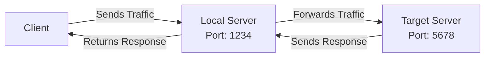
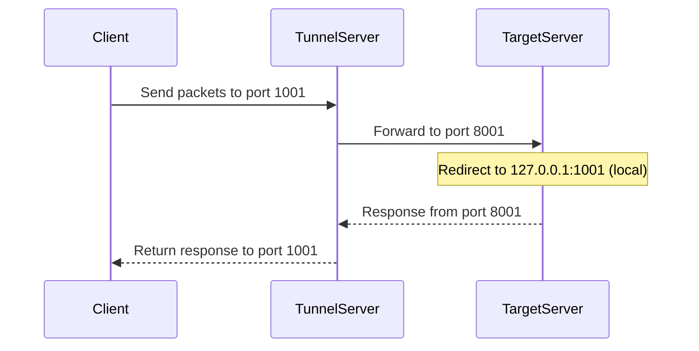
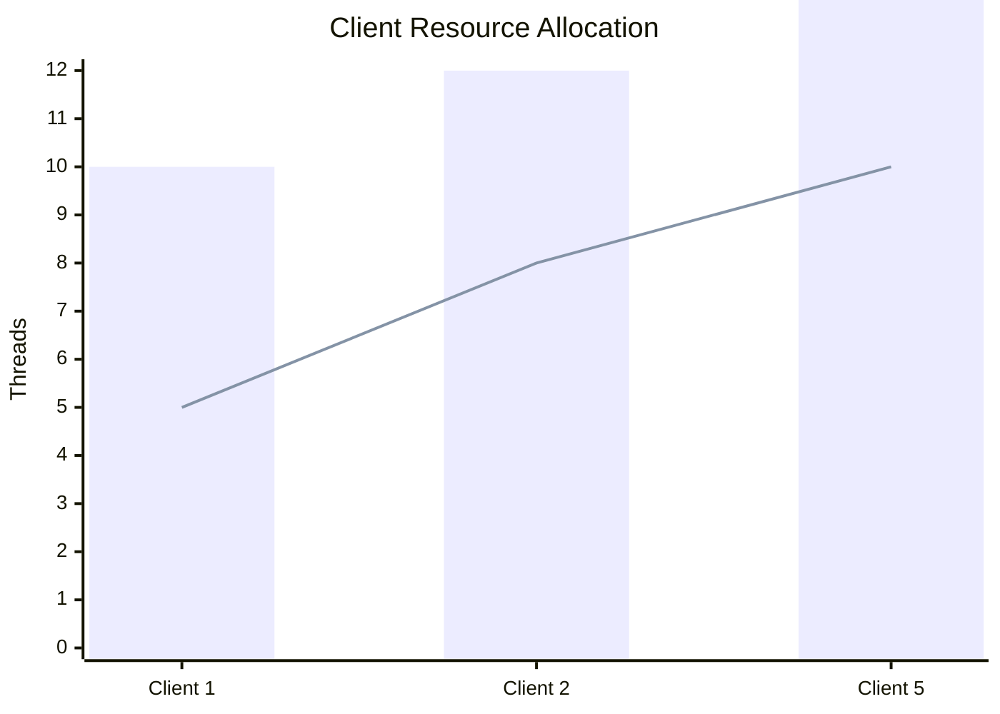

# Server Tunnel

TunnelServer is a lightweight and efficient TCP tunneling server designed for secure and reliable data transfer.  
It allows forwarding network traffic between two servers, making it useful for proxying,  
bypassing network restrictions, and securing communications.

## Simple functionality

You run the app as a single-server instance on a server or personal system. 
By configuring the port, local address, and the target server port and address, you create a single-server tunnel that forwards all incoming traffic from the specified local port to the target port on the desired server. 
Additionally, the data sent from the target server is returned to the client connected to the local port. 
In fact, a bidirectional connection between the connected client and the target server is established using the intermediary server's resources.
You can better understand its simple functionality in the diagram below.



## Example of functionality combination

Another usage scenario, which is essentially a combination of functionalities, is redirecting incoming traffic to a different port. 
For example, a client connects to port 1001 on the tunnel server and sends its packets to this port. The TunnelServer, running on the tunnel server, receives the packets from port 1001 and forwards them to port 8001 on the target server. The target server then receives the packets on its port 8001 and redirects them to its local port 1001 with the IP address (127.0.0.1). Essentially, this creates a two-way connection between the client and the target server on port 8001 of the target server.



# Installation
1- Download the latest version of TunnelServer
```bash
sudo mkdir /opt/tunnel
sudo cd /opt/tunnel
sudo wget https://github.com/Hsnmsri/server-tunnel/releases/download/v1.0.0/TunnelServer?raw=true
```

2- Create a `settings.json` file to configure the program
```bash
sudo touch settings.json
```

3- Edit `settings.json` and add desired configurations
```bash
sudo vim settings.json
```
- Insert following settings to the file
```json
{
    "logging": {
        "level": "None"
    },
    "local": {
        "ip": "LOCAL_IP",
        "port": LOCAL_PORT
    },
    "server": {
        "ip": "TARGET_IP",
        "port": TARGET_PORT
    }
}
```
`` Check the configured values and replace them with your desired values ``

4- Save `settings.json` file and run the TunnelServer
```bash
sudo chmod a+x TunnelServer
sudo ./TunnelServer
```

### Configuration Systemd service and run it in the background
```bash
sudo nano /etc/systemd/system/tunnel.service
```
- Insert following configuration in the service file
```text
[Unit]
Description=Tunneling Service
After=network.target

[Service]
ExecStart=/opt/tunnel/TunnelServer
Restart=always
User=root
Group=root
Environment=DISPLAY=:0
Environment=XAUTHORITY=/root/.Xauthority
WorkingDirectory=/opt/tunnel
StandardOutput=syslog
StandardError=syslog

[Install]
WantedBy=multi-user.target
```
- Run `tunnel` service
```bash
sudo systemctl start tunnel.service
```

## Performance and resource consumption

The performance is fully optimized and set to the maximum possible level. 
Additionally, resource consumption is kept to the minimum, but there is still room for improvement. 
Efforts will continue to reduce resource consumption in future versions.

